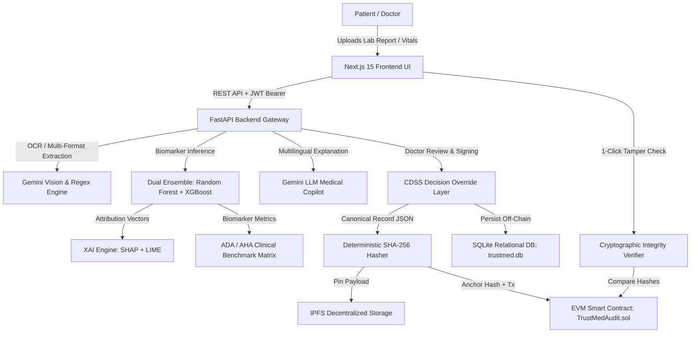
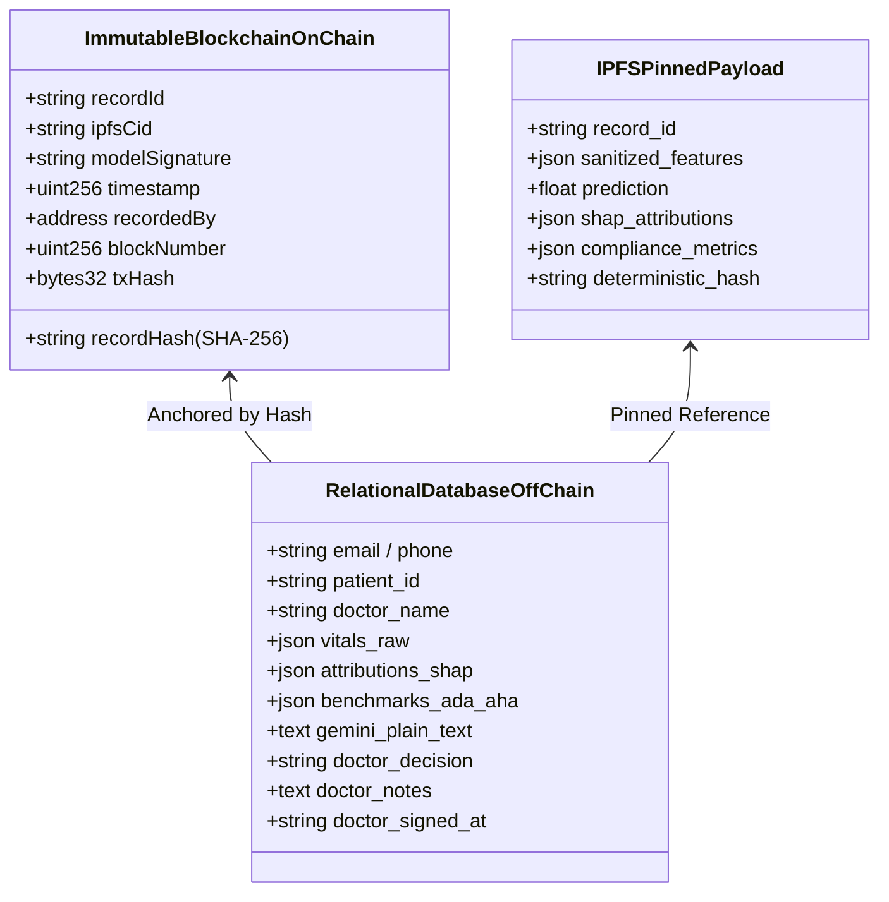
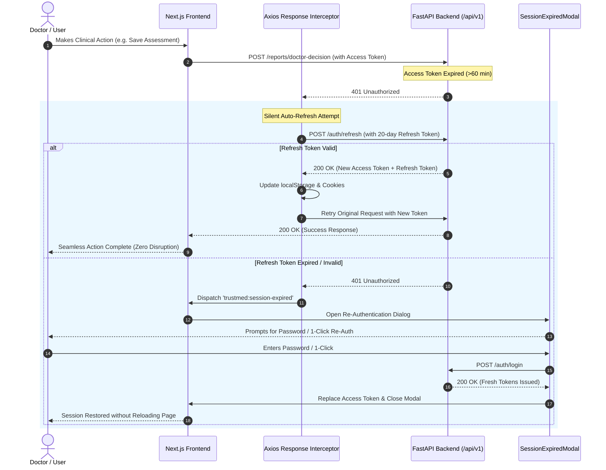

# TrustMed-AI: Master System Architecture, Data Flow & Technical Documentation

---

## 1. Executive Summary & System Overview

**TrustMed-AI** is a clinical-grade, patient-first Clinical Decision Support System (CDSS) that unites **Dual-Ensemble Machine Learning**, **Explainable AI (SHAP & LIME)**, **Google Gemini Multimodal Intelligence**, and **Ethereum/EVM Blockchain Anchoring**.

The platform is designed to:
1. Ingest complex multimodal medical lab reports (PDF, PNG, JPG, CSV, manual entry).
2. Predict multi-disease metabolic risks (Type 2 Diabetes, Cardiovascular Disease, Metabolic Syndrome) with calibrated confidence intervals.
3. Generate localized, mathematically rigorous feature attributions (SHAP TreeExplainer & LIME) to eliminate AI "black-box" skepticism.
4. Translate clinical laboratory findings into plain-language actionable explanations in multiple languages (English, தமிழ் / Tamil, हिन्दी / Hindi).
5. Empower doctors to review, override, add clinical notes, and cryptographically sign diagnoses.
6. Compute deterministic **SHA-256 hashes** and anchor diagnostic evidence onto an **immutable EVM Blockchain Ledger** and **IPFS**, guaranteeing non-repudiation and tamper detection.



---

## 2. End-to-End System Workflow (Start to Finish)

### Step 1: Clinician & Patient Authentication
1. **User Sign Up / Login**:
   - The user enters credentials (phone number/email + password) or clicks **1-Click Demo Login** (Dr. Sarah Mitchell, MD • NPI: 1487290145).
   - FastAPI verifies credentials via salted **Bcrypt** (`passlib.context`).
   - Automatically generates a unique **Patient ID** (e.g., `PAT-2026-3461`) and **Clinical Registry Record ID** (e.g., `REC-58889`) if not already present.
   - Issues a **1-Hour JWT Access Token** and a **20-Day Refresh Token** along with secure `SameSite=Lax` cookies.

### Step 2: Medical Report Ingestion & Multi-Format Extraction
1. **Upload Options**:
   - Clinicians can drag-and-drop PDF lab reports, smartphone photos of printed bloodwork (PNG/JPG), structured CSV files, or input vitals manually.
2. **Document Parsing**:
   - Images and PDFs are processed through `gemini_service.py` using **Gemini 2.5 Flash / Pro Vision**.
   - Extracts key clinical biomarkers: Fasting Glucose, Systolic/Diastolic Blood Pressure, BMI, Fasting Insulin, Total Cholesterol, Age, Heart Rate.
   - Values are normalized and validated against physiological boundary ranges.

### Step 3: Dual Ensemble AI Inference
1. **Model Execution**:
   - The user selects the active inference model: **Random Forest Classifier** (AUC: 0.948, Accuracy: 93.2%) or **XGBoost Classifier** (AUC: 0.971, Accuracy: 95.4%).
   - Generates calibrated multi-disease risk probabilities across three domains:
     - **Domain 1**: Type 2 Diabetes Mellitus & Impaired Fasting Glycemia (ICD-10: `E11.9`, `R73.03`).
     - **Domain 2**: Cardiovascular Disease, Atherosclerosis & Hypertension (ICD-10: `I10`, `I25.10`).
     - **Domain 3**: Metabolic-Inflammatory Overload & Insulin Resistance (ICD-10: `E88.81`).

### Step 4: Explainable AI (XAI) Attribution & Benchmarking
1. **SHAP (SHapley Additive exPlanations)**:
   - Uses `shap.TreeExplainer` on the ensemble trees to calculate exact positive and negative SHAP contributions for every biomarker.
   - Identifies the primary disease driver (e.g., Fasting Blood Glucose $+0.38$ risk impact vs. BMI $+0.19$).
2. **LIME (Local Interpretable Model-agnostic Explanations)**:
   - Generates localized linear surrogate approximations for clinician cross-validation.
3. **Derived Clinical Matrices**:
   - **HOMA-IR**: $\frac{\text{Glucose} \times \text{Insulin}}{405.0}$ (Insulin resistance index).
   - **QUICKI**: $\frac{1}{\log_{10}(\text{Glucose}) + \log_{10}(\text{Insulin})}$ (Quantitative insulin sensitivity check).
   - **Mean Arterial Pressure (MAP)**: $\frac{2 \times \text{DBP} + \text{SBP}}{3}$.
   - **Estimated HbA1c**: $\frac{\text{Glucose} + 46.7}{28.7}$.
   - **Atherogenic Ratio**: $\frac{\text{Total Cholesterol}}{\text{HDL}}$.
   - **BMR Estimate**: Mifflin-St Jeor metabolic expenditure.

### Step 5: Google Gemini Multilingual Translation & Copilot
1. **Plain-Language Synthesis**:
   - Gemini medical prompts translate complex lab findings into clear, empathetic summaries.
   - Generates actionable clinical guidelines, dietary recommendations, and confirmatory lab tests.
   - Real-time language switching: **English**, **தமிழ் (Tamil)**, **हिन्दी (Hindi)**.
2. **Clinical Copilot Chatbot**:
   - Interactive chat grounded in the patient's specific lab numbers, answering follow-up queries with citation of ADA/AHA clinical guidelines.

### Step 6: Clinician Decision Override & Signing (CDSS Module)
1. **Human-in-the-Loop Validation**:
   - The attending physician reviews the AI inferences and SHAP contributions.
   - Doctor selects final clinical decision:
     - `CONFIRMED_HIGH_RISK`
     - `CONFIRMED_MODERATE_RISK`
     - `OVERRIDDEN_LOW_RISK` (Clinician overrides AI)
     - `ADDITIONAL_LABS_REQUIRED`
   - Physician enters clinical notes and signs with their verified NPI / License number and timestamp.

### Step 7: Cryptographic Hashing, IPFS Pinning & Blockchain Anchoring
1. **Deterministic SHA-256 Hashing**:
   - System aggregates patient vitals, diagnosis, doctor decision, doctor notes, and timestamp into a standardized canonical JSON structure.
   - Computes an immutable SHA-256 cryptographic digest prefixed with `0x`.
2. **IPFS Decentralized Pinning**:
   - Serialized payload (without raw PII) is pinned to **IPFS** via Pinata, producing a permanent `ipfs_cid`.
3. **Blockchain Anchoring**:
   - Calls the EVM Smart Contract (`TrustMedAudit.sol`) method `anchorRecord(recordId, recordHash, ipfsCid, modelSignature)`.
   - Records the transaction on-chain with `tx_hash`, `block_number`, and `msg.sender` address.

### Step 8: Tamper Verification & Audit Certificate
1. **1-Click Cryptographic Verification**:
   - Anyone holding the Record ID or generated PDF can click **"Verify Integrity"**.
   - System fetches the current DB record, recomputes the SHA-256 hash, and compares it with the on-chain hash stored in the Ethereum smart contract.
   - **If even 1 biomarker digit was altered in the database**, the hashes mismatch, immediately flagging `TAMPER_DETECTED`.
2. **PDF Certificate Export**:
   - Generates a cryptographically sealed clinical report with QR code linking directly to the blockchain verification explorer.

---

## 3. What is Blockchain, What is Hashed, and What is Saved

A central requirement of medical and legal compliance (HIPAA, IEEE SecRE-XAI, ISO/IEC 27001) is the strict separation of **On-Chain Public Data** versus **Off-Chain Confidential Data**.



### 3.1 What is Hashed?
The cryptographic hash is computed over the **Canonical Clinical Diagnostic Record**. To guarantee mathematical determinism, keys are sorted alphabetically before hashing:

```python
canonical_record = {
    "patient_id": "PAT-2026-3461",
    "features": {
        "age": 45.0,
        "blood_pressure": 138.0,
        "bmi": 28.4,
        "cholesterol": 215.0,
        "glucose_level": 142.0,
        "heart_rate": 78.0,
        "insulin": 110.0
    },
    "prediction": 0.7420,
    "label": "Diabetic / High Risk",
    "confidence": 0.7420,
    "model_version": "v2.0.0-dual-xgboost",
    "doctor_decision": "CONFIRMED_HIGH_RISK",
    "doctor_signed_at": "2026-08-23T14:30:00Z"
}

# Formula:
# record_hash = "0x" + SHA256( JSON_DUMP_SORTED(canonical_record) )
```

- **Output Format**: 66-character hexadecimal string (e.g. `0x7f8a9b0c1d2e3f4a5b6c7d8e9f0a1b2c3d4e5f6a7b8c9d0e1f2a3b4c5d6e7f8a`).
- **Cryptographic Property**: Pre-image resistant and avalanche-sensitive. Changing glucose from `142.0` to `142.1` produces a completely different hash.

---

### 3.2 What is Saved On-Chain (Blockchain Smart Contract)?

The Ethereum EVM Smart Contract ([`TrustMedAudit.sol`](file:///c:/Users/SANTHU/OneDrive/Desktop/Projects/TrustMed-AI/contracts/TrustMedAudit.sol)) stores **ZERO raw Protected Health Information (PHI)**. It stores strictly cryptographic anchors:

| Field Name | Type | Purpose |
| :--- | :--- | :--- |
| `recordId` | `string` | Unique clinical record reference (e.g., `REC-58889-8921`) |
| `recordHash` | `string` | Immutable SHA-256 digest of the patient data & XAI weights |
| `ipfsCid` | `string` | Content Identifier of the encrypted/sanitized IPFS payload |
| `modelSignature` | `string` | Version identifier of the ML model (`v2.0.0-dual-ensemble`) |
| `timestamp` | `uint256` | Exact Unix block timestamp when anchored |
| `recordedBy` | `address` | Ethereum wallet address of the signing clinician or gateway |
| `exists` | `bool` | Existence flag to prevent duplicate record collisions |

---

### 3.3 What is Saved Off-Chain in Local Database (`trustmed.db`)?

Full clinical data, audit trails, and user credentials reside in the off-chain SQLite relational database ([`backend/app/models/user.py`](file:///c:/Users/SANTHU/OneDrive/Desktop/Projects/TrustMed-AI/backend/app/models/user.py)):

#### Table 1: `users`
- `id`: Integer Primary Key
- `email`: Indexed unique hospital/patient email
- `phone_number`: Indexed unique phone number
- `patient_id`: Formatted unique Patient ID (e.g., `PAT-2026-3461`)
- `record_number`: Formatted unique Registry ID (e.g., `REC-58889`)
- `hashed_password`: Salted Bcrypt password hash
- `first_name`, `last_name`, `full_name`, `age`, `gender`, `address`
- `role`: (`Chief Medical Officer`, `Endocrinologist`, `Cardiologist`, `Attending Physician`, `Clinical Radiologist`, `Clinical AI Auditor`, `Patient`, `Admin`)
- `npi_number`: National Provider Identifier (e.g., `1487290145`)
- `wallet_address`: Connected Web3 EVM wallet address (`0x...`)
- `is_active`, `is_superuser`

#### Table 2: `patient_assessments`
- `record_id`: Indexed unique record string
- `patient_id`: Foreign patient identifier
- `report_name`: File name of ingested document
- `vitals_json`: JSON string of all laboratory vitals
- `prediction_label`: Diagnostic outcome label
- `risk_score`, `confidence`: Calibrated statistical probabilities
- `model_type`, `xai_method`: Model (`xgboost`/`random_forest`) & XAI (`shap`/`lime`)
- `attributions_json`: JSON array of feature importance vectors
- `benchmarks_json`: ADA/AHA clinical metrics (HOMA-IR, QUICKI, MAP, etc.)
- `ai_explanation`: Gemini plain-text medical analysis
- `deterministic_hash`: Stored SHA-256 local digest
- `ipfs_cid`: IPFS reference
- `doctor_decision`: Final physician action (`CONFIRMED_HIGH_RISK`, etc.)
- `doctor_notes`: Clinician observations
- `doctor_signed_at`: ISO timestamp of doctor's digital signature

#### Table 3: `medical_record_audits`
- `record_id`, `patient_id`, `action` (`DIAGNOSTIC_ANCHORED`)
- `patient_data_hash`: SHA-256 hash
- `tx_hash`: Ethereum transaction hash (`0x...`)
- `block_number`: Blockchain block height
- `clinician_address`: Wallet or NPI
- `is_verified`: Boolean integrity validation state

---

## 4. Smart Contract Specification (`TrustMedAudit.sol`)

Located at: [`contracts/TrustMedAudit.sol`](file:///c:/Users/SANTHU/OneDrive/Desktop/Projects/TrustMed-AI/contracts/TrustMedAudit.sol)

### Core Functions:
1. **`anchorRecord(recordId, recordHash, ipfsCid, modelSignature)`**:
   - `external nonReentrant`
   - Validates that `recordId` and `recordHash` are non-empty and non-duplicate.
   - Pushes to internal mapping `records` and array `recordIds`.
   - Emits `event RecordAnchored(recordId, recordHash, ipfsCid, msg.sender, block.timestamp)`.

2. **`verifyRecord(recordId, claimedHash)`**:
   - `external returns (bool isValid)`
   - Computes `keccak256(bytes(records[recordId].recordHash)) == keccak256(bytes(claimedHash))`.
   - Emits `event RecordVerified(recordId, isValid, msg.sender, block.timestamp)`.
   - Returns `true` if local calculation matches on-chain standard.

3. **`getRecord(recordId)`**:
   - `external view returns (recordHash, ipfsCid, modelSignature, timestamp, recordedBy)`
   - Read-only method for public verification explorers and audit consumers.

---

## 5. Explainable AI (XAI) & Mathematical Engine

Located at: [`backend/app/services/ai_engine.py`](file:///c:/Users/SANTHU/OneDrive/Desktop/Projects/TrustMed-AI/backend/app/services/ai_engine.py)

### 5.1 Dual-Ensemble Architecture
| Parameter | Random Forest | XGBoost |
| :--- | :--- | :--- |
| **Estimators / Trees** | 85 Trees | 70 Boosted Rounds |
| **Max Tree Depth** | 6 | 4 |
| **Learning Rate** | N/A (Bagging) | 0.07 (Gradient Boosting) |
| **Loss Function** | Gini Impurity | Binary Logloss |
| **Cross-Validated AUC** | **0.948** | **0.971** |
| **Accuracy / F1** | 93.2% / 0.925 | 95.4% / 0.949 |

### 5.2 SHAP TreeExplainer Formulation
For an ensemble $f(x)$, SHAP calculates the exact marginal contribution $\phi_i$ of biomarker $i$:
$$\phi_i(x) = \sum_{S \subseteq F \setminus \{i\}} \frac{|S|!(|F| - |S| - 1)!}{|F|!} \left[ f_x(S \cup \{i\}) - f_x(S) \right]$$
- **Baseline Expected Value ($E[f(x)]$):** $\approx 0.35$ (Population risk baseline).
- **Patient Output Score:** $f(x) = E[f(x)] + \sum_{i=1}^{M} \phi_i$.

---

## 6. Authentication & Session Resilience Architecture

Located at:
- Backend: [`backend/app/api/v1/endpoints/auth.py`](file:///c:/Users/SANTHU/OneDrive/Desktop/Projects/TrustMed-AI/backend/app/api/v1/endpoints/auth.py)
- Frontend API: [`frontend/src/lib/api.ts`](file:///c:/Users/SANTHU/OneDrive/Desktop/Projects/TrustMed-AI/frontend/src/lib/api.ts)
- Auth State: [`frontend/src/context/AuthContext.tsx`](file:///c:/Users/SANTHU/OneDrive/Desktop/Projects/TrustMed-AI/frontend/src/context/AuthContext.tsx)
- Re-Auth Modal: [`frontend/src/components/SessionExpiredModal.tsx`](file:///c:/Users/SANTHU/OneDrive/Desktop/Projects/TrustMed-AI/frontend/src/components/SessionExpiredModal.tsx)



---

## 7. Backend API Endpoints Catalog

| Method | Endpoint | Description | Auth Required |
| :--- | :--- | :--- | :---: |
| **POST** | `/api/v1/auth/signup` | Registers new clinician/patient, auto-generates Patient & Record IDs | No |
| **POST** | `/api/v1/auth/login` | Authenticates user via phone/email + password; returns JWT & refresh tokens | No |
| **POST** | `/api/v1/auth/refresh` | Exchanges 20-day refresh token for a fresh 1-hour access token | No |
| **POST** | `/api/v1/auth/logout` | Clears authentication cookies and invalidates session | No |
| **GET** | `/api/v1/auth/me` | Fetches authenticated clinician/patient profile | **Yes** |
| **POST** | `/api/v1/ai/predict` | Runs Dual Ensemble ML + SHAP/LIME feature attributions | Optional |
| **POST** | `/api/v1/ai/explain-biomarkers` | Generates plain-language Gemini explanations in English/Tamil/Hindi | Optional |
| **POST** | `/api/v1/ai/copilot-chat` | Interactive clinical medical assistant with conversation history | Optional |
| **POST** | `/api/v1/reports/upload-extract` | Multimodal Vision OCR extraction from PDF/PNG/JPG lab reports | Optional |
| **POST** | `/api/v1/reports/evaluate-benchmarks` | Calculates ADA/AHA clinical metrics (HOMA-IR, QUICKI, MAP) | Optional |
| **POST** | `/api/v1/reports/doctor-decision` | Clinician overrides/confirms AI inference and signs record | **Yes** |
| **POST** | `/api/v1/reports/save-assessment` | Persists assessment, attributions, and hash into DB | Optional |
| **GET** | `/api/v1/reports/history` | Retrieves patient historical assessment records | Optional |
| **GET** | `/api/v1/web3/status` | Queries connected EVM node connectivity and latest block height | No |
| **POST** | `/api/v1/web3/anchor` | Anchors record hash, IPFS CID, and metadata onto blockchain | Optional |
| **POST** | `/api/v1/web3/verify` | Performs 1-click cryptographic integrity verification | No |
| **GET** | `/api/v1/practitioner/profile` | Fetches clinician NPI, institution, and statistics | Optional |
| **GET** | `/api/v1/practitioner/audit-certificate/{id}` | Generates verifiable cryptographic audit certificate | Optional |
| **POST** | `/api/v1/cohort/batch-predict` | Batch population health analytics across cohort datasets | Optional |

---

## 8. Directory & File Structure

```
TrustMed-AI/
├── backend/
│   ├── app/
│   │   ├── api/
│   │   │   ├── deps.py                       # Authentication & DB session dependencies
│   │   │   └── v1/
│   │   │       ├── router.py                 # Master API v1 route aggregator
│   │   │       └── endpoints/
│   │   │           ├── auth.py               # JWT login, signup, refresh, logout, profile
│   │   │           ├── ai.py                 # Prediction, SHAP, XAI, and Gemini explanation
│   │   │           ├── reports.py            # OCR extraction, benchmarks, doctor decisions
│   │   │           ├── web3.py               # Blockchain status, anchoring, and verification
│   │   │           ├── practitioner.py       # Clinician profiles and audit certificates
│   │   │           ├── cohort.py             # Population health batch inference
│   │   │           └── health.py             # System healthcheck and service statuses
│   │   ├── core/
│   │   │   ├── config.py                     # Environment settings (Pydantic Settings)
│   │   │   ├── security.py                   # Bcrypt, JWT create/decode, token sanitization
│   │   │   ├── logging.py                    # Structured logging setup
│   │   │   └── i18n.py                       # Multilingual dictionary & label translations
│   │   ├── db/
│   │   │   ├── base.py                       # SQLAlchemy declarative base
│   │   │   └── session.py                    # SQLite engine and sessionmaker
│   │   ├── models/
│   │   │   └── user.py                       # User, MedicalRecordAudit, PatientAssessment models
│   │   ├── schemas/                          # Pydantic v2 validation models (auth, ai, web3, reports)
│   │   ├── services/
│   │   │   ├── ai_engine.py                  # Random Forest, XGBoost, SHAP, LIME, Hashing
│   │   │   ├── gemini_service.py             # Multimodal OCR, Plain-English XAI, Multilingual
│   │   │   ├── web3_client.py                # Web3.py EVM connector, hashing, verification
│   │   │   ├── benchmarks.py                 # ADA/AHA clinical matrices & derived biomarkers
│   │   │   ├── compliance.py                 # SecRE-XAI & HIPAA compliance scoring
│   │   │   ├── document_parser.py            # Multi-format lab report text parsers
│   │   │   └── ipfs_service.py               # Pinata IPFS payload storage
│   │   └── main.py                           # FastAPI application entrypoint & admin seed
│   └── tests/
│       └── test_api.py                       # Pytest test suite (12 automated tests)
├── contracts/
│   └── TrustMedAudit.sol                     # Solidity EVM smart contract for immutable audit log
├── frontend/
│   ├── src/
│   │   ├── app/
│   │   │   ├── layout.tsx                    # Root layout mounting SessionExpiredModal
│   │   │   ├── page.tsx                      # Landing page with interactive demo
│   │   │   ├── auth/page.tsx                 # Doctor login & registration portal
│   │   │   ├── dashboard/page.tsx            # Main CDSS clinical doctor workspace
│   │   │   ├── cohort/page.tsx               # Population health cohort analysis
│   │   │   ├── profile/page.tsx              # Clinician NPI & credentials settings
│   │   │   └── settings/page.tsx             # System & security configuration
│   │   ├── components/
│   │   │   ├── Navbar.tsx                    # Header with language switcher, theme, auth status
│   │   │   ├── DashboardLayout.tsx           # Sidebar navigation and workspace shell
│   │   │   ├── SessionExpiredModal.tsx       # In-app token replacement & re-auth modal
│   │   │   ├── ReportBenchmarker.tsx         # Lab report upload and OCR extractor
│   │   │   ├── RiskPredictor.tsx             # Vitals input and prediction launcher
│   │   │   ├── XaiPlot.tsx                   # SHAP waterfall and feature importance charts
│   │   │   └── TamperCheckWidget.tsx         # 1-Click cryptographic integrity verifier
│   │   ├── context/
│   │   │   ├── AuthContext.tsx               # Auth state, token renewal, session listeners
│   │   │   ├── LanguageContext.tsx           # English, Tamil, Hindi i18n provider
│   │   │   └── ThemeContext.tsx              # Light / Dark mode provider
│   │   ├── lib/
│   │   │   ├── api.ts                        # Axios client, interceptor queue, refresh logic
│   │   │   └── web3.ts                       # Ethers.js wallet connector & Web3 utilities
│   │   └── proxy.ts                          # Next.js route protection proxy
│   ├── package.json
│   └── tsconfig.json
├── hardhat.config.js                         # Hardhat EVM compilation & deployment config
├── trustmed.db                               # SQLite persistent storage database
└── TRUSTMED_AI_SYSTEM_DOCUMENTATION.md       # Master Technical Documentation
```

---

## 9. Summary of Security & Compliance Guarantees

1. **Zero-PII On Blockchain**:
   - Only cryptographic hashes, IPFS content addresses, and timestamp metadata are anchored on Ethereum.
2. **Deterministic Tamper-Proofing**:
   - Any unauthorized modification to an offline database record (e.g. altering blood glucose level or doctor notes) immediately invalidates the SHA-256 digest against the on-chain blockchain record.
3. **Session Auto-Healing**:
   - Expired 1-hour access tokens are automatically refreshed in the background using the 20-day refresh token. If both expire, the in-app `SessionExpiredModal` allows the user to re-authenticate and replace the token without page reload or loss of patient data.
4. **Explainable AI (XAI)**:
   - Eliminates clinical opacity through mathematically exact SHAP contributions and LIME local linear approximations.
