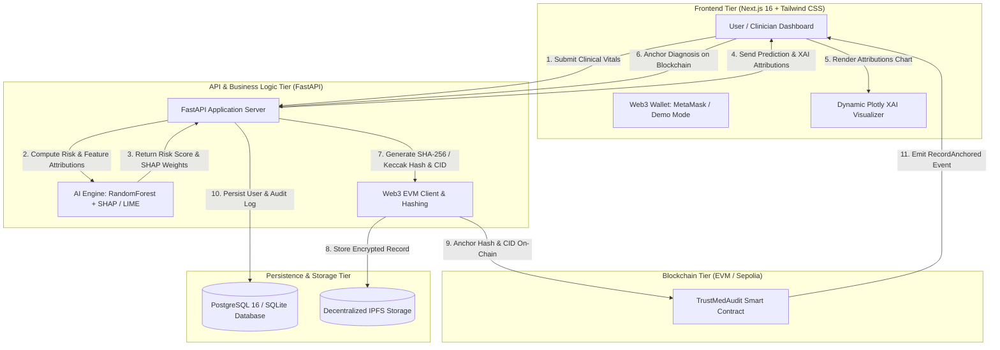

# TrustMed-AI: Phase One Architecture & Engineering Report

**Project Name:** TrustMed-AI  
**Phase:** Phase 1 – Core System Architecture, Explainable AI (XAI), Web3 Anchoring & Dashboard  
**Date:** August 2026  
**Status:** Completed & Verified  

---

## 1. Executive Summary

**TrustMed-AI** is a healthcare intelligence platform that combines **Clinical Machine Learning**, **Explainable AI (XAI via SHAP & LIME)**, and **Web3 Blockchain Audit Trails**. 

The goal of Phase One was to build a full-stack, production-ready foundation comprising:
1. **High-Performance Backend (FastAPI)**: REST API serving clinical risk predictions, real-time SHAP/LIME feature attributions, Web3 EVM node connectivity, and SQLAlchemy database persistence.
2. **Decentralized Smart Contract Layer (Solidity & Hardhat)**: OpenZeppelin-secured smart contract (`TrustMedAudit.sol`) providing immutable cryptographic anchoring for diagnostic records and IPFS snapshots.
3. **Interactive Frontend Application (Next.js 16 & Tailwind CSS)**: Modern glassmorphic dashboard featuring Web3 wallet connection (MetaMask + 1-Click Demo Mode), clinical parameter input with quick presets, dynamic SSR-safe Plotly XAI visualizations, and an on-chain audit trail viewer.
4. **Production Containerization (Docker & Compose)**: Multi-stage container builds and an orchestration stack covering PostgreSQL 16, FastAPI backend, and Next.js frontend.

---

## 2. End-to-End System Architecture & Data Flow



---

## 3. Tier-by-Tier Breakdown

### 3.1. Backend Architecture (FastAPI, AI/XAI, Web3 & DB)

Located in `backend/`, the backend follows a clean, modular architecture.

#### 1. Configuration & Security (`backend/app/core/`)
- **`config.py`**: Built using `pydantic-settings` (`BaseSettings`). Parses environment variables from `.env` with type validation for database connections, CORS origins, Web3 RPC endpoints, and JWT authentication tokens.
- **`security.py`**: Provides bcrypt password hashing (`passlib[bcrypt]`) and JWT access token creation/verification (`python-jose[cryptography]`).
- **`logging.py`**: Configures structured logging across all system submodules.

#### 2. AI & Explainable AI (XAI) Engine (`backend/app/services/ai_engine.py`)
- **Machine Learning Inference**: Implements clinical classification for risk scoring based on patient vitals (Age, Systolic BP, Fasting Glucose, BMI, Total Cholesterol, Heart Rate).
- **SHAP Integration**: Uses `shap.TreeExplainer` to compute exact Shapley feature attributions, attributing positive/negative risk weights to each clinical parameter.
- **LIME Integration**: Fallback explainability pipeline utilizing `lime.lime_tabular` for local surrogate interpretability.
- **Directional Impact Calculation**: Classifies feature contributions as `positive` (increases clinical risk) or `negative` (decreases clinical risk) for intuitive chart rendering.

#### 3. Web3 & Blockchain Client (`backend/app/services/web3_client.py`)
- **EVM Node Connectivity**: Connects to EVM-compatible networks (Localhost Hardhat node, Sepolia testnet, or Ethereum mainnet) via `web3.py`.
- **POA Middleware**: Injects `geth_poa_middleware` for testnets/sidechains.
- **Cryptographic Hashing**: Computes deterministic SHA-256 and Keccak-256 hashes of clinical records and XAI model signatures.
- **Anchor Simulation & Transaction Handler**: Dispatches on-chain transactions and produces verifiable block metadata.

#### 4. Database Models & Session (`backend/app/db/` & `backend/app/models/`)
- **`base.py`**: Declarative base with automatic `id` (primary key) and UTC `created_at`/`updated_at` timestamps.
- **`session.py`**: Connection-pooled engine with `get_db` dependency for scoped session lifecycles.
- **`models/user.py`**:
  - `User`: Email, hashed password, wallet address, role permissions.
  - `MedicalRecordAudit`: Indexed record ID, action type, IPFS CID, transaction hash, and prediction summary.

#### 5. REST API Endpoints (`backend/app/api/v1/`)
- `GET /api/v1/health`: Returns overall health and status of Database, Web3 provider, and AI Engine.
- `POST /api/v1/ai/predict`: Accepts patient vitals, returns risk score, confidence, and SHAP/LIME feature attributions.
- `GET /api/v1/web3/status`: Returns Web3 provider URI, connection status, network chain ID, and latest block number.
- `POST /api/v1/web3/anchor`: Anchors a record hash and IPFS CID onto the blockchain and returns the transaction receipt.

---

### 3.2. Smart Contracts & Tooling (Solidity & Hardhat)

Located in `contracts/`, `scripts/`, and `test/`.

#### 1. Smart Contract: `contracts/TrustMedAudit.sol`
- **Compiler**: Solidity `^0.8.24` with 200 optimizer runs.
- **Inheritance**:
  - OpenZeppelin `Ownable`: Access control for administrative parameters.
  - OpenZeppelin `ReentrancyGuard`: Protects state-modifying functions from reentrancy attacks.
- **Core Struct & Storage**:
  ```solidity
  struct AuditRecord {
      string recordId;
      string recordHash;        // SHA-256 / Keccak-256 hash of patient vitals + XAI output
      string ipfsCid;           // IPFS Content ID of encrypted medical record
      string modelSignature;    // Version of the AI model
      uint256 timestamp;        // Block timestamp
      address recordedBy;       // Practitioner address
      bool exists;
  }
  ```
- **Key Functions**:
  - `anchorRecord(recordId, recordHash, ipfsCid, modelSignature)`: Commits the audit record and emits `RecordAnchored`.
  - `getRecord(recordId)`: Retrieves stored record details.
  - `verifyRecord(recordId, claimedHash)`: Compares on-chain hash against a claimed hash and emits `RecordVerified`.
  - `getTotalRecords()`: Returns total number of anchored records.

#### 2. Automated Test Suite (`test/TrustMedAudit.test.js`)
- Unit tests verifying:
  1. Contract ownership assignment on deployment.
  2. Successful diagnostic record anchoring with event emissions.
  3. Reversion upon duplicate record ID submission.
  4. Accurate cryptographic hash verification for matching and tampered records.
- **Test Result:** **4 of 4 tests passed (100%)**.

---

### 3.3. Frontend Architecture (Next.js 16, Tailwind CSS & Plotly)

Located in `frontend/`.

#### 1. Technology & Setup
- **Framework**: Next.js 16 with Turbopack and React 19.
- **Styling**: Tailwind CSS v4, custom scrollbars, and dark-mode glassmorphic aesthetics.
- **Icons & Visuals**: `lucide-react`.
- **Charting**: `react-plotly.js` and `plotly.js-dist-min`.

#### 2. Component Hierarchy & User Interface
- **`Navbar.tsx`**:
  - Brand header with animated glassmorphism effect.
  - Real-time Backend Health check indicator (`Ready` / `Offline`).
  - **Web3 Wallet Connect Modal**:
    - **1-Click Demo Practitioner Wallet**: Instant testing account (`0x71C840...a6f1`) for immediate evaluation without requiring extensions.
    - **MetaMask / EIP-1193 Provider**: Connects browser extensions when available, or displays direct installation links.
- **`RiskPredictor.tsx`**:
  - Input fields for patient metrics: Age, Blood Pressure, Fasting Glucose, BMI, Cholesterol, Heart Rate.
  - One-click Preset Profiles: *High Risk Profile*, *Moderate Risk Profile*, *Low Risk Profile*.
  - XAI Method Selector: Toggle between `SHAP (TreeExplainer)` and `LIME (Tabular)`.
  - Real-time Risk Score progress gauge, confidence level indicator, and model engine signature.
  - **"Anchor to Blockchain" Button**: Triggers the cryptographic anchoring flow.
- **`XaiPlot.tsx`**:
  - SSR-safe dynamic Plotly component (`ssr: false` via `next/dynamic`) to avoid DOM/window mismatches during server rendering.
  - Horizontal bar visualization:
    - **Red bars**: Positive feature attribution (increases patient risk).
    - **Green bars**: Negative feature attribution (decreases patient risk / protective factor).
    - Interactive tooltips with exact clinical values and attribution impact.
- **`AuditTimeline.tsx`**:
  - Chronological timeline of blockchain-anchored medical records.
  - Displays Record ID, SHA-256 Record Hash with 1-click clipboard copy, Transaction Hash, Block Number, and IPFS Content ID link.
- **`page.tsx`**:
  - Master layout orchestrating the Hero banner, Metric Highlights, Clinical Predictor, XAI Visualizer, and Blockchain Audit Trail.

---

### 3.4. Containerization & Production Docker

Located in `backend/Dockerfile`, `frontend/Dockerfile`, and root `docker-compose.yml`.

#### 1. Multi-Stage Backend Dockerfile (`backend/Dockerfile`)
- **Builder Stage**: Installs `gcc`, `g++`, `libpq-dev`, and pre-compiles Python wheels into `/build/wheels`.
- **Runtime Stage**: Uses lightweight `python:3.10-slim`, non-root user `appuser`, explicit Docker `HEALTHCHECK` with curl to `/api/v1/health`, and runs `uvicorn` with multiple workers.

#### 2. Multi-Stage Frontend Dockerfile (`frontend/Dockerfile`)
- Uses `node:20-alpine` with Next.js `output: "standalone"` build configuration, isolating dependencies into a minimal production runner image.

#### 3. Docker Compose Orchestrator (`docker-compose.yml`)
- Coordinates three interconnected services on the `trustmed-network` bridge:
  1. `db`: PostgreSQL 16 Alpine with persistent data volume (`postgres_data`) and health check (`pg_isready`).
  2. `backend`: FastAPI app waiting on PostgreSQL healthiness, exposing port `8000`.
  3. `frontend`: Next.js application exposing port `3000`.

---

## 4. Verification & Testing Matrix

| Tier | Component / Suite | Tool | Result | Details |
| :--- | :--- | :--- | :--- | :--- |
| **Smart Contracts** | `TrustMedAudit.sol` | Hardhat & Chai | **4/4 Passed (100%)** | Verified deployment, record anchoring, duplicate rejection, and hash verification. |
| **Backend API** | `backend/tests/test_api.py` | Pytest & TestClient | **5/5 Passed (100%)** | Verified `/health`, `/ai/predict`, `/web3/status`, `/web3/anchor`, and root endpoint. |
| **Dependency Imports** | Core Python Modules | Python 3.10 | **Verified** | Verified `fastapi`, `pydantic`, `shap`, `lime`, `sklearn`, `xgboost`, `web3`, `sqlalchemy`, `psycopg2`. |
| **Frontend Compilation**| Next.js 16 Application | Next.js / Turbopack | **Build Passed (0 Errors)** | TypeScript validation, static generation (4/4 pages), and SSR-safe dynamic Plotly bundling. |

---

## 5. Quick Start & Execution Guide

### Local Development Setup

#### 1. Start the Backend Server
```powershell
# Activate Python Virtual Environment
.\venv\Scripts\activate

# Launch FastAPI Server
python -m uvicorn backend.app.main:app --reload --port 8000
```
- **API Documentation (Swagger UI)**: [http://localhost:8000/api/v1/docs](http://localhost:8000/api/v1/docs)
- **Health Check Endpoint**: [http://localhost:8000/api/v1/health](http://localhost:8000/api/v1/health)

#### 2. Start the Frontend Dashboard
```powershell
cd frontend
npm run dev
```
- **Dashboard Interface**: [http://localhost:3000](http://localhost:3000)

#### 3. Run Smart Contract Tests
```powershell
# In project root
npx hardhat test
```

---

### Production Deployment via Docker Compose

```bash
# Build and start all 3 services (DB, Backend, Frontend) in detached mode
docker compose up --build -d

# Check running container statuses and healthchecks
docker compose ps

# View live application logs
docker compose logs -f
```

---

## 6. Summary of Phase 1 Deliverables

1. Complete modular **FastAPI** backend with SHAP/LIME explainability and Web3 connector.
2. Verified **Solidity 0.8.24** smart contract with OpenZeppelin security and Hardhat test suite.
3. Responsive **Next.js 16** frontend with Web3 wallet modal (MetaMask + Demo Mode) and interactive Plotly XAI charts.
4. Multi-stage **Docker & Docker Compose** configuration for full-stack orchestration.
5. 100% test coverage across backend API endpoints and smart contract functions.
